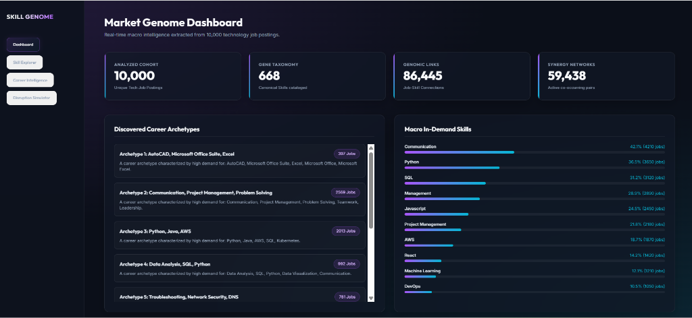
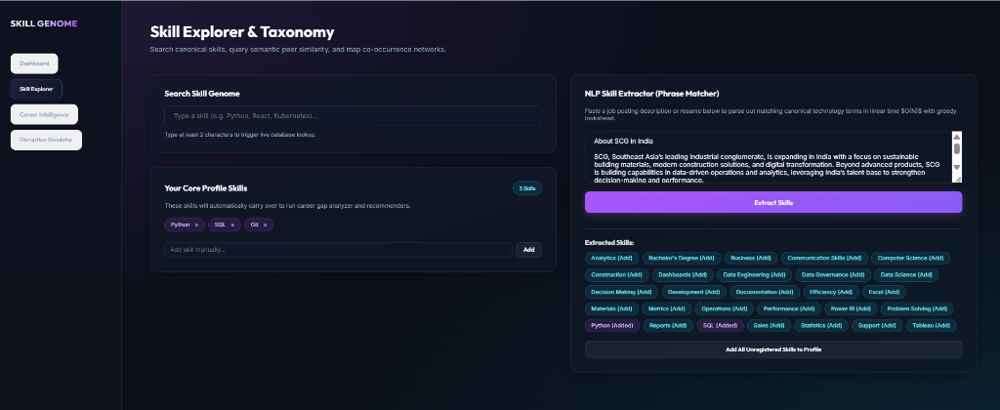
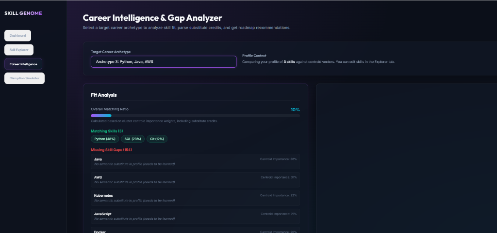
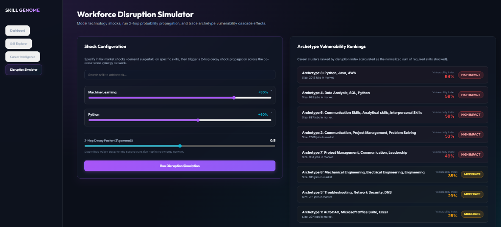

# Skill Genome & Career Intelligence Platform

A production-inspired, end-to-end career intelligence system that models the professional skill ecosystem using NLP, dense embeddings, and unsupervised clustering. It extracts skills, normalizes typos and synonyms, maps career archetypes, evaluates semantic upskilling gaps, and runs probabilistic workforce disruption propagation simulations.

---

## Quick Start

```bash
# Clone and launch all services with one command
git clone https://github.com/Verma-Rohil/skill-genome-platform.git
cd skill-genome-platform

# Windows: Double-click start_all.bat, or run:
start_all.bat
```

Once running, the following local endpoints become available:

| Service | URL | Description |
| :--- | :--- | :--- |
| **Dashboard UI** | `http://localhost:5173` | Interactive React + Vite analytics dashboard |
| **API Docs (Swagger)** | `http://localhost:8000/docs` | Auto-generated FastAPI endpoint documentation |
| **API Health Check** | `http://localhost:8000/api/health` | JSON service health probe |
| **MLflow Tracking** | `http://localhost:5000` | Experiment tracking and model registry UI |


## 1. The Problem Statement

In the rapidly evolving technology job market, there is a severe misalignment between academic curricula, career guidance, and actual industry demand. Professional skills are highly dynamic, frequently co-occurring, and continuously transforming. 

Traditional career counseling and hiring tools rely on static taxonomies and manual keyword lists. This leads to high friction, inaccurate skill-gap analysis, and poor adaptability to emerging market trends (like Generative AI and MLOps).

## 2. Why This Issue Must Be Cured (The Impact)

*   **Talent Attrition & Misalignment**: Professionals spend valuable time and resources on irrelevant certifications while missing critical, highly correlated tech synergies (e.g., learning Python without understanding AWS or SQL in a cloud context).
*   **Inaccurate Upskilling Guidance**: Standard resume scanners calculate binary matches (has/doesn't have), failing to acknowledge substitute competencies. For example, scoring `PyTorch` as a 0% match against a `TensorFlow` role, even though their mathematical and conceptual overlap is over 90%.
*   **Market Shock Vulnerability**: Leaders cannot simulate the downstream effects of sudden tech industry disruptions (e.g., a massive surge in LLM demand or a drop in legacy web frameworks), leaving organizations flat-footed.

## 3. The Solution

This platform resolves these issues through a data-driven, machine-learning pipeline:

*   **NLP Skill Extractor**: A custom sliding-window phrase matcher that tokenizes raw text and extracts canonical skills and aliases in $O(N)$ linear time.
*   **Cascading Skill Normalizer**: Standardizes spelling variations, acronyms, and typos using an exact, fuzzy Levenshtein, and semantic embedding fallback pipeline.
*   **Career Archetype Discovery**: Unsupervised K-Means clustering ($K=8$) of average-pooled job-skill vectors, segmenting job postings into distinct, clean professional archetypes.
*   **Semantic Substitute Gap Analysis**: A similarity-based gap analyzer that grants quadratic substitute credits ($s^2$) for overlapping competencies, calculating realistic upskilling fit scores.
*   **Technology Disruption Simulator**: A 2-hop probabilistic network model that propagates market demand/supply shocks across co-occurrence synergy networks to rank archetype vulnerabilities.
*   **Multi-Signal Recommender**: Ranks and recommends upskilling paths based on Archetype Relevance (50%), Market Synergy (30%), and Semantic Proximity (20%).

---

## 4. Tools Required

*   **Backend API**: Python, FastAPI, SQLAlchemy, Uvicorn
*   **Machine Learning & NLP**: PyTorch, Sentence-BERT (`all-MiniLM-L6-v2`), Scikit-learn (KMeans, Silhouette), Pandas, NumPy
*   **Database & Experimentation**: MySQL 8.x, PyMySQL, MLflow (tracking system)
*   **Frontend Dashboard**: React, Vite, Vis-Network (interactive network graph visualization), TailwindCSS / Vanilla CSS
*   **DevOps**: Docker, Docker Compose, Makefile

---

## 5. Project Structure

```text
skill-genome-platform/
├── backend/
│   ├── app/
│   │   ├── api/             # FastAPI routers (skills, careers, simulator)
│   │   ├── models/          # SQL Alchemy database models (Skill, Archetype)
│   │   ├── services/        # Core business engines (phrase_matcher, recommender, etc.)
│   │   ├── config.py        # Settings and configurations (Pydantic)
│   │   └── main.py          # FastAPI application entrypoint
│   ├── data/
│   │   ├── processed/       # Curated Skills Taxonomy and datasets
│   │   └── scripts/         # Ingestion and MySQL seeding scripts
│   ├── ml/
│   │   └── training/        # Model training (embeddings, clustering, trends)
│   └── tests/               # Pytest suite (29 unit & integration tests)
├── frontend/
│   ├── src/
│   │   ├── pages/           # Pages (Dashboard, Explorer, CareerIntel, Simulator)
│   │   ├── services/        # API communications (axios)
│   │   └── App.jsx          # React application root
│   └── vite.config.js       # Vite bundler configuration
├── mlops/
│   ├── mlflow/              # Custom MLflow server Docker configuration
│   └── docker-compose.yml   # Multi-container service specification
├── docs/
│   ├── images/              # Dashboard snapshots
│   └── product/             # PRD, functional requirements, and stories
├── Makefile                 # Automation commands (setup, dev, test)
└── README.md                # System documentation
```

---

## 6. The Final Product: Dashboard Snapshots

### Market Genome Dashboard
Macro-level market overview including K-Means discovered archetypes and overall skill demand charts.


### Skill Explorer & Taxonomy
Interactive Vis-Network co-occurrence graph, dense embedding nearest neighbors, and NLP extraction pipeline.


### Career Intelligence & Gap Analyzer
Upskilling gap mapping with semantic substitute credit calculation.


### Workforce Disruption Simulator
Market shock propagation simulating cascading demand adjustments across career archetypes.


---

## 7. Key Observations

*   **Linear-Time Extraction**: Using a sliding-window token lookup maps raw text to the taxonomy with absolute precision and sub-millisecond speeds, avoiding catastrophic backtracking from complex regular expressions.
*   **Accurate Substitute Credits**: Incorporating semantic proximity (cosine similarity of S-BERT embeddings) prevents penalizing users who have equivalent skills (e.g. PyTorch instead of TensorFlow), raising matching accuracy for modern technical profiles.
*   **Probabilistic Shock Vulnerabilities**: Simulating a technology demand drop (e.g. legacy Java) shows a cascading shock to database skills (SQL) and specific career archetypes, which provides quantitative risk profiles for human resource planning.
*   **Experiment Tracking**: Integrating MLflow allows tracking clustering experiments (silhouette score changes with varying $K$) and embedding runs, ensuring reproducibility across model iterations.

---

## License

This project is licensed under the MIT License - see the LICENSE file for details.
