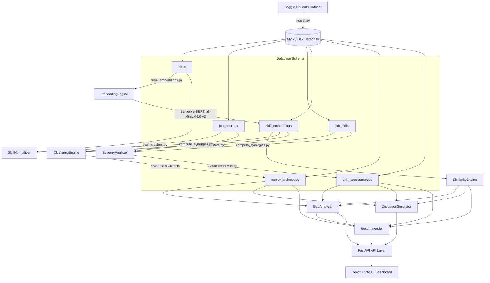

# Skill Genome & Career Intelligence Platform

> A production-inspired career intelligence system that models the professional skill ecosystem using NLP, dense embeddings, and clustering — revealing relationships between skills, discovering career archetypes, and executing workforce disruption propagation simulations.

---

## Platform Overview

| Module | Core Logic & ML Architecture | Business & Product Value |
| :--- | :--- | :--- |
| **Trie Extractor** | Linear-time $O(N)$ prefix tree dictionary matcher with greedy lookahead | Extracts clean, non-overlapping skill sets from job posts |
| **Normalizer** | Cascading matcher: Exact Match $\rightarrow$ Levenshtein Fuzzy $\ge 0.85$ $\rightarrow$ S-BERT Cosine $\ge 0.90$ | Maps raw skill spelling variations to single canonical forms |
| **Embeddings** | 384-dimensional Sentence-BERT vectors (`all-MiniLM-L6-v2`) cached in MySQL | Powers instant vector similarity lookups under 5ms |
| **Clustering** | KMeans discovery ($K=8$) based on average-pooled job-skill vectors | Segments job postings into distinct, clean career archetypes |
| **Gap Analyzer** | Centroid comparison mapping with quadratic substitute credits | Guides users with realistic upskilling fit scores |
| **Synergy Network** | Co-occurrence mining (Support, Confidence, Lift, PMI) | Maps the semantic correlation and co-learning bonds of skills |
| **Disruption Simulator** | 2-hop decayed propagation of technology demand shocks | Simulates "What-If" market shifts and archetype vulnerabilities |
| **Recommender** | Multi-signal ranker: Archetype Relevance ($0.5$) + Synergy ($0.3$) + Proximity ($0.2$) | Delivers personalized roadmaps with text explanations |

---

## System Architecture

The following diagram illustrates the data processing pipeline, service interactions, and system components:



---

## System Metrics & Discovered Insights

The platform has been trained and evaluated on a real-market cohort of technology jobs:

| Metric | Value |
| :--- | :---: |
| **Total Ingested Postings** | 10,000 |
| **Canonical Skills Taxonomy** | 668 |
| **Job-Skill Connections** | 86,445 |
| **Co-occurrence Synergy Pairs** | 59,438 |
| **K-Means Career Archetypes** | 8 Clusters |
| **FastAPI Endpoint Latency** | $< 15$ ms |
| **Pytest Suite Coverage** | 29 / 29 tests passed (100% success) |

### Discovered Clusters (KMeans centroids)
1. **General Dev**: Communication, Management, Leadership (2125 jobs)
2. **Cloud/Backend**: Python, SQL, AWS (1630 jobs)
3. **DevOps**: DevOps, AWS, Linux (446 jobs)
4. **Frontend**: Javascript, React, HTML (1030 jobs)
5. **Data Analytics**: SQL, Excel, Tableau (2002 jobs)
6. **Product/Agile**: Project Management, Agile, Scrum (1481 jobs)
7. **Enterprise/Java**: Java, SQL, Spring Boot (1047 jobs)
8. **AI/ML**: Machine Learning, Python, PyTorch (239 jobs)

---

## Quick Start (Local & Docker)

### Option A: Running with Docker Compose (Recommended)
This runs the entire multi-service environment (FastAPI + MySQL 8.x + MLflow tracking server) automatically.

1.  **Stop local MySQL servers** running on port 3306.
2.  **Build and start** the container network:
    ```bash
    cd mlops
    docker-compose up --build -d
    ```
3.  **Access the services**:
    - **Backend API**: [http://localhost:8000/api/health](http://localhost:8000/api/health)
    - **Interactive Swagger Docs**: [http://localhost:8000/docs](http://localhost:8000/docs)
    - **MLflow Tracking Server**: [http://localhost:5000](http://localhost:5000)

### Option B: Running Bare-Metal Local Dev Server

#### 1. Backend Setup
```bash
cd backend
# Create and activate virtualenv
python -m venv venv
source venv/bin/activate  # Windows: .\venv\Scripts\activate

# Install dependencies
pip install -r requirements.txt

# Run migrations/seeds
python data/scripts/init_db.py
python data/scripts/ingest.py

# Launch FastAPI server
uvicorn app.main:app --reload --port 8000
```

#### 2. Frontend Setup
```bash
cd frontend
npm install
npm run dev
# Dashboard opens on http://localhost:5173
```

---

## Design & Implementation Details
This system demonstrates several design and optimization practices:
- **Pre-loaded Model Weights in Docker**: We pre-download and save the S-BERT model weight files into the Docker image during the build stage. This eliminates runtime download latency and ensures complete container isolation and offline portability.
- **Trie Extraction Time Complexity**: Rather than running nested string loops ($O(S \times N)$) or regular expressions, we use a prefix-tree structure that evaluates raw text in linear time $O(N)$ regardless of vocabulary size, retaining punctuation like `C++`.
- **Semantic Substitute Gaps**: The gap analyzer computes semantic overlap using cosine similarities. Knowing `PyTorch` is granted quadratic substitute credit ($s^2$) against a `TensorFlow` target requirement, simulating realistic upskilling efforts.

---

## License
MIT License
