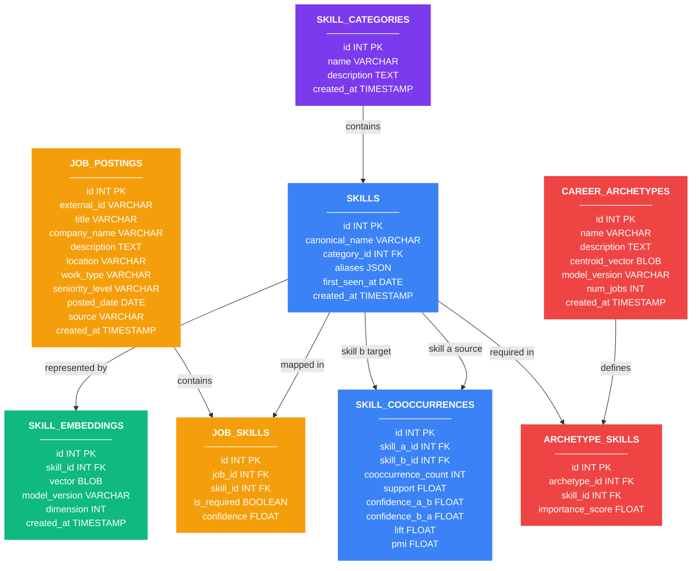

# Data Model Design Document

## Skill Genome Platform

---

## 1. Entity-Relationship Design (ERD)

The Skill Genome Platform uses a relational database schema designed to model the professional skill ecosystem, capture co-occurrence network metrics, map career archetypes, and log user-facing simulations.

The following **Mermaid diagram** illustrates the entities, columns, types, and their relationships:

---

## 2. Key Architecture Design Tradeoffs

### A. MySQL vs. Dedicated Vector Database (e.g., Pinecone/FAISS)

* **Our Decision:** Store skill and centroid vectors as serialized byte strings (**BLOBs**) in MySQL and load them into a flat NumPy memory matrix at application startup.
* **Why?** In a skill taxonomy, the vocabulary is relatively compact (typically ~800 to 2,000 canonical skills). Loading 1,000 vectors of size 384 (S-BERT) into memory takes less than 3 MB of RAM.
* **Tradeoff:** A dedicated Vector Database adds significant operational complexity, networking hops, and financial cost without providing any latency benefit at this scale. By using in-memory matrix operations (via NumPy) at runtime, we achieve sub-millisecond similarity searches ($<1\text{ms}$) while keeping the database stack simple and portable.

### B. Many-to-Many Job-Skill Mapping

* **Our Decision:** Implement a junction table `job_skills` with unique constraints on the pair `(job_id, skill_id)` and a foreign key delete cascade.
* **Why?** Normalizing skills out of job descriptions prevents massive data redundancy. Storing an extraction confidence score on this junction table allows us to filter out weak entity matches at runtime.

### C. Co-occurrence Network over Extrapolated Trends

* **Our Decision:** Pivot from temporal trend snapshot tables to a structural pairwise synergy table (`skill_cooccurrences`).
* **Why?** Future forecasting using Prophet on static 2024 data is logically flawed. The new design models structural co-occurrences (Support, Confidence, Lift, and Pointwise Mutual Information). This enables graph representation of skill dependencies and a **workforce disruption simulation engine** built on conditional probabilities $P(\text{Skill B} | \text{Skill A})$.

---

## 3. Data Integrity & Normalization Rules

1. **First Normal Form (1NF):** All tables have a designated single-column Primary Key (`id`), and all column values are atomic (JSON column `aliases` acts as a controlled dictionary).
2. **Second & Third Normal Form (2NF & 3NF):** Skills and job descriptions are fully isolated. Skill categories are normalized to a separate table `skill_categories` instead of duplicating strings.
3. **Referential Integrity Constraints:** All foreign keys utilize `ON DELETE CASCADE` strategies (e.g., deleting a job description automatically purges its junction matches in `job_skills`), except for `skills.category_id` which utilizes `ON DELETE SET NULL` to preserve canonical skills even if their category is deleted.
