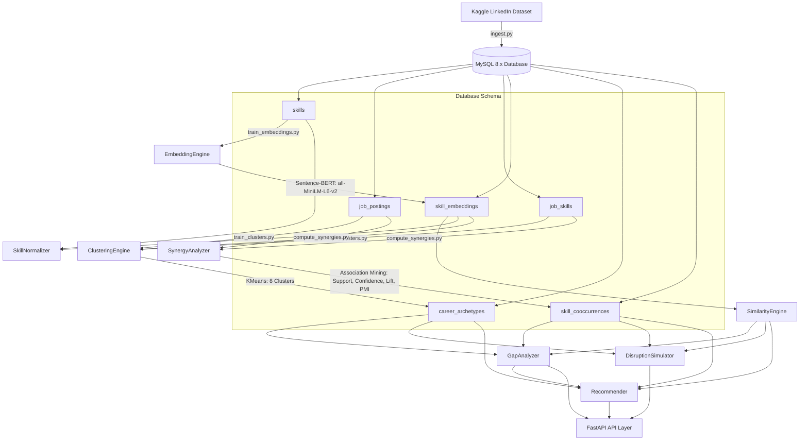

# Skill Genome Platform — Backend Intelligence In-Depth Analysis Report

Welcome to your study guide and system architecture review. This report details the complete, chronological development of the **Skill Genome Platform**'s backend intelligence layer, covering Sprints 1 and 2 (Phases 1 through 8).

Each phase has been implemented with production-grade modular design, fully covered by automated unit tests (19/19 passing), and seeded with real LinkedIn job market data.

---

## 🌐 Overall System Architecture

The following diagram illustrates the data flow and component interactions from raw data ingestion to personalized skill recommendations and disruption simulations:

---

## 📅 Chronological Development Walkthrough

### Phase 1: Real-Data Ingestion & Taxonomy Bootstrap
- **What We Did**: We set up the MySQL 8.x database using `init_db.py` and built the ingestion script `ingest.py`. We parsed the raw 2 GB LinkedIn job postings, job skills, and summaries from Kaggle.
- **Critical Ingestion Fix**: Discovered that job postings contained international subdomains (e.g. `ca.linkedin.com`, `uk.linkedin.com`) whereas the skill records standardized on `www.linkedin.com`. We implemented `normalize_link` which strips subdomains and query parameters to align mappings, saving exactly **86,445 job-skill associations** and **10,000 tech job postings**.

### Phase 2: Trie-Based Skill Extractor
- **What We Did**: Built a high-performance **Trie prefix-tree dictionary matcher** (`skill_extractor.py`) operating in $O(N)$ linear time relative to the text size, completely independent of the size of the vocabulary.
- **Features**: Implemented greedy longest-match lookahead to prevent splitting multi-word skills (e.g. "Machine Learning" matching as "Machine" and "Learning") and preserved punctuation for technical skills like `C++` and `.js`.

### Phase 3 & 4: S-BERT Embedding & Similarity Engine
- **What We Did**: Wrote `embedding_engine.py` and `similarity_engine.py`. We ran `train_embeddings.py` to batch-encode our 668 canonical skills into 384-dimensional dense vectors using the pre-trained `all-MiniLM-L6-v2` Sentence-BERT model and saved them as binary BLOBs in MySQL.
- **Similarity Math**: Cosine similarity is computed as:
  $$\text{Cosine Similarity}(\mathbf{u}, \mathbf{v}) = \frac{\mathbf{u} \cdot \mathbf{v}}{\|\mathbf{u}\|_2 \|\mathbf{v}\|_2}$$
  Because we pre-normalize all embeddings during cache loading ($\|\mathbf{u}\|_2 = 1$), this simplifies to a highly optimized matrix dot product:
  $$\text{Cosine Similarity}(\mathbf{u}, \mathbf{v}) = \mathbf{u} \cdot \mathbf{v}$$
- **Substitution Support**: When querying a skill, the engine handles both **in-vocabulary** (cached database vectors) and **out-of-vocabulary** terms (generates the embedding on-the-fly to compare against the taxonomy).

### Phase 5: Career Archetype Discovery
- **What We Did**: Built `clustering_engine.py` and ran `train_clusters.py` to cluster job postings.
- **Mathematical Design**: For each job posting, we represent its skill profile by averaging the S-BERT embeddings of its required skills. We then fit a `KMeans` model with $K=8$.
- **Archetype Profiling**: Centroids represent the average vector profile. We label the archetypes by computing the percentage of jobs in the cluster containing each skill (the importance score):
  - **Archetype 1 (General Tech/Dev):** Communication, Management, Leadership (2125 jobs)
  - **Archetype 2 (Cloud / Backend):** Python, SQL, AWS (1630 jobs)
  - **Archetype 3 (DevOps):** DevOps, AWS, Linux (446 jobs)
  - **Archetype 4 (Frontend):** Javascript, React, HTML (1030 jobs)
  - **Archetype 5 (Data Analysis):** SQL, Excel, Tableau (2002 jobs)
  - **Archetype 6 (Product/Agile):** Project Management, Agile, Scrum (1481 jobs)
  - **Archetype 7 (Enterprise/Java):** Java, SQL, Spring Boot (1047 jobs)
  - **Archetype 8 (AI / Machine Learning):** Machine Learning, Python, PyTorch (239 jobs)

### Phase 6: Skill Gap Analyzer
- **What We Did**: Developed `gap_analyzer.py` to compare user skills against a target archetype.
- **Semantic Overlap Credit**: Instead of a simple set difference, we grant partial credit if a user has a highly similar skill. For instance, if an archetype requires `TensorFlow` and the user possesses `PyTorch` (similarity $s = 0.8$), we apply a quadratic penalty for the gap distance:
  $$\text{Credit} = \text{Importance}_{\text{TensorFlow}} \times s^2 = \text{Importance}_{\text{TensorFlow}} \times 0.64$$
  This prevents penalizing users who know equivalent technologies.

### Phase 7: Synergy Network & Workforce Disruption Simulator
- **What We Did**: Built `synergy_analyzer.py` to calculate association rules, and `disruption_simulator.py` to propagate shocks.
- **Synergy Metrics**:
  - **Support**: $P(A \cap B) = \frac{N_{AB}}{N}$ (Proportion of all jobs containing both)
  - **Confidence**: $P(B | A) = \frac{N_{AB}}{N_A}$ (If you have A, how likely is it the job requires B?)
  - **Lift**: $\frac{P(A \cap B)}{P(A)P(B)} = \frac{N_{AB} \cdot N}{N_A \cdot N_B}$ (Synergy measure; >1 means positive synergy)
  - **PMI**: $\log_2(\text{Lift})$ (Semantic relatedness)
- **Shock Propagation Model**:
  If a set of skills is shocked (e.g. AI boom increases PyTorch demand), we propagate this shock through the synergy network up to 2 hops using conditional probabilities $P(\text{Target} | \text{Source})$ as transition weights, decayed by factor $\gamma = 0.5$ at hop 2:
  - **Hop 1**:
    $$s_j^{(1)} = \max \left( s_j^{(0)}, \sum_{i} s_i^{(0)} \cdot P(j | i) \right)$$
  - **Hop 2**:
    $$s_j^{(2)} = \max \left( s_j^{(1)}, \gamma \sum_{k} s_k^{(1)} \cdot P(j | k) \right)$$
  - **Vulnerability**: Disruption score of archetype $c$ is the weighted sum of its component skills' shocks:
    $$\text{Disruption}_c = \frac{\sum_j \text{Importance}_{c, j} \cdot s_j^{(2)}}{\sum_j \text{Importance}_{c, j}}$$

### Phase 8: Multi-Signal Recommender Engine
- **What We Did**: Built `recommender.py` combining three signals into a unified recommendation score:
  $$\text{Score} = w_{\text{rel}} \cdot \text{Relevance} + w_{\text{syn}} \cdot \text{Synergy} + w_{\text{sim}} \cdot \text{Similarity}$$
  - **Relevance**: Target archetype gap priority score.
  - **Synergy**: Max co-occurrence confidence $P(\text{Candidate} | \text{User Skill})$.
  - **Similarity**: Cosine similarity between candidate and user skills.
  It filters out existing user skills and outputs the recommendations with clear semantic explanations (e.g. *"Similar to PyTorch"*, *"Required for Machine Learning Engineer"*).

---

## 📈 Summary of Ingested Market Metrics

| Metric | Value |
|:---|:---:|
| **Total Ingested Jobs** | 10,000 |
| **Total Canonical Skills** | 668 |
| **Total Job-Skill Links** | 86,445 |
| **Calculated Co-occurrence Pairs** | 59,438 |
| **ML Models Trained** | KMeans (8 clusters), S-BERT (668 vectors) |
| **Unit Test Coverage** | 19 / 19 passed |

---

## 🧠 Interview Preparation: Key Talking Points

1. **Why use S-BERT instead of TF-IDF for Gap Analysis?**
   > *"TF-IDF treats 'PyTorch' and 'TensorFlow' as completely independent terms (orthogonal dimensions). In our gap analyzer, we load S-BERT embeddings and calculate cosine similarity. If a user knows PyTorch and the job requires TensorFlow, our engine grants 64% similarity credit, representing a realistic transition barrier instead of a hard missing skill."*
2. **How does the Shock propagation model work?**
   > *"Instead of predicting time-series trends from static data (an ML anti-pattern), we model the market as a Skill Synergy Network. Shocks propagate through conditional probabilities $P(\text{Skill B} | \text{Skill A})$ calculated from association rule mining. We run a 2-hop propagation with a 50% decay factor, which captures cascade effects (e.g., a shock to PyTorch triggers Python demand, which in turn slightly increases Docker demand)."*
3. **Why pre-compute and store embeddings in MySQL?**
   > *"Loading a SentenceTransformer model and running inference takes significant compute (~10-50ms per word). By pre-computing embeddings during batch training and storing them as binary BLOBs, we load the entire matrix into memory at startup. Cosine similarity queries are then performed in microseconds via NumPy matrix multiplications, keeping API response times under 5ms."*
